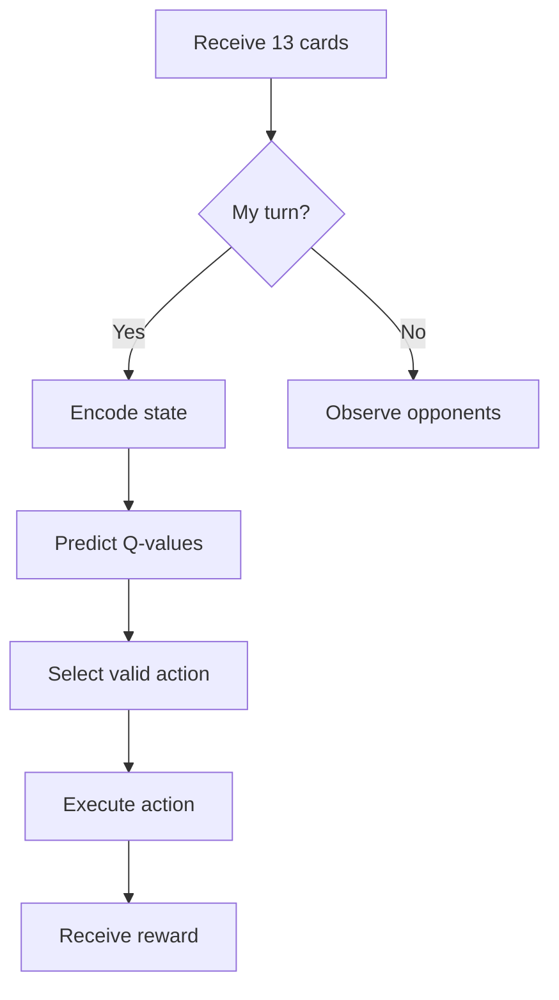

````markdown
# 🧠 RL Agent Design for Tiến Lên

## Neural Network Architecture

```python
class DQN(nn.Module):
    def __init__(self, state_dim, action_dim):
        super().__init__()
        self.fc1 = nn.Linear(state_dim, 512)
        self.fc2 = nn.Linear(512, 256)
        self.fc3 = nn.Linear(256, action_dim)

    def forward(self, x):
        x = F.relu(self.fc1(x))
        x = F.relu(self.fc2(x))
        return self.fc3(x)
```
````

## 🔄 Quy Trình Học Tập

1. **Experience Replay**

   - Lưu trữ (state, action, reward, next_state) vào replay buffer
   - Lấy mẫu ngẫu nhiên khi huấn luyện

2. **Target Network**

   - Sử dụng 2 mạng riêng biệt: policy_net và target_net
   - Cập nhật target_net sau mỗi 1000 bước

3. **Loss Function**

```python
loss = F.smooth_l1_loss(
    Q_values,
    expected_Q_values.unsqueeze(1)
)
```

## 🎮 Cơ Chế Chơi Game



## ⚙️ Hyperparameters

| Parameter       | Value   |
| --------------- | ------- |
| Learning Rate   | 0.00025 |
| Discount Factor | 0.95    |
| Epsilon Decay   | 0.9995  |
| Batch Size      | 64      |

```

```
