# 🧠 RL Agent Design for Tiến Lên

## Neural Network Architecture

```python
class ResidualBlock(nn.Module):
    def __init__(self, in_channels):
        super(ResidualBlock, self).__init__()
        self.conv1 = nn.Conv2d(in_channels, in_channels, kernel_size=3, padding=1)
        self.bn1 = nn.BatchNorm2d(in_channels)
        self.conv2 = nn.Conv2d(in_channels, in_channels, kernel_size=3, padding=1)
        self.bn2 = nn.BatchNorm2d(in_channels)

    def forward(self, x):
        residual = x
        out = F.relu(self.bn1(self.conv1(x)))
        out = self.bn2(self.conv2(out))
        out += residual
        out = F.relu(out)
        return out

class TienLenNet(nn.Module):
    def __init__(self):
        super(TienLenNet, self).__init__()
        self.conv1 = nn.Conv2d(6, 128, kernel_size=3, padding=1)
        self.bn1 = nn.BatchNorm2d(128)

        # Residual blocks
        self.res_blocks = nn.Sequential(
            ResidualBlock(128),
            ResidualBlock(128),
            ResidualBlock(128)
        )

        # Policy head
        self.policy_conv = nn.Conv2d(128, 4, kernel_size=1)
        self.policy_bn = nn.BatchNorm2d(4)
        self.policy_fc1 = nn.Linear(4 * 4 * 13, 512)
        self.policy_fc2 = nn.Linear(512, 256)
        self.policy_out = nn.Linear(256, 200)

        # Value head
        self.value_conv = nn.Conv2d(128, 2, kernel_size=1)
        self.value_bn = nn.BatchNorm2d(2)
        self.value_fc1 = nn.Linear(2 * 4 * 13, 256)
        self.value_fc2 = nn.Linear(256, 128)
        self.value_out = nn.Linear(128, 1)
        self.value_activation = nn.Tanh()
```

## 🔄 Quy Trình Học Tập

1. **Experience Replay**: Lưu trữ trải nghiệm trong buffer nén

```python
class PPOBuffer:
    def __init__(self, gamma=0.99, gae_lambda=0.95):
        self.states = []
        self.actions = []
        self.log_probs = []
        self.values = []
        self.rewards = []
        self.dones = []
```

2. **MCTS với Resolving Liên Tục**: Tìm kiếm cây Monte Carlo

```python
class MCTS:
    def __init__(self, model, num_simulations=50, use_cache=True,
                 use_continual_resolving=True):
        self.model = model
        self.num_simulations = num_simulations
        self.use_cache = use_cache
        self.use_continual_resolving = use_continual_resolving
```

3. **Huấn luyện PPO**: Cập nhật mô hình với gradient clipping

```python
def ppo_train(model, buffer, optimizer, scaler, clip_epsilon=0.2,
             ppo_epochs=4, batch_size=128):
    # Policy loss (clipped surrogate)
    ratio = (new_log_probs - old_log_probs).exp()
    surr1 = ratio * advantages
    surr2 = torch.clamp(ratio, 1.0 - clip_epsilon, 1.0 + clip_epsilon) * advantages
    policy_loss = -torch.min(surr1, surr2).mean()
```

## 🎮 Cơ Chế Chơi Game

```mermaid
graph TD
    A[Khởi tạo game] --> B{Đến lượt AI?}
    B -->|Có| C[MCTS chọn nước đi]
    B -->|Không| D[Bot rule-based đánh]
    C --> E[Cập nhật trạng thái]
    D --> E
    E --> F{Game kết thúc?}
    F -->|Chưa| B
    F -->|Rồi| G[Lưu kết quả huấn luyện]
```



## ⚙️ Hyperparameters

| Parameter       | Value  |
| --------------- | ------ |
| Learning Rate   | 0.0002 |
| Discount Factor | 0.99   |
| PPO Epochs      | 4      |
| Batch Size      | 256    |
