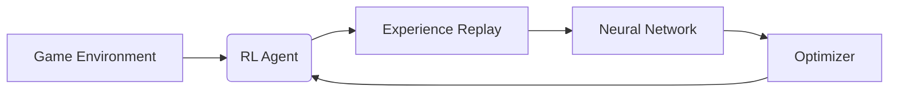

````markdown
# 🛠 Technology Stack

## 📚 Core Libraries

| Library    | Version | Purpose                  |
| ---------- | ------- | ------------------------ |
| PyTorch    | 2.0+    | Deep Learning Framework  |
| NumPy      | 1.22+   | Scientific Computing     |
| Gymnasium  | 0.28+   | RL Environment Interface |
| Matplotlib | 3.7+    | Visualization            |
| tqdm       | 4.65+   | Progress Bars            |

## 🖥️ Hardware Requirements

| Component | Recommended                 |
| --------- | --------------------------- |
| CPU       | 4+ cores                    |
| RAM       | 16GB+                       |
| GPU       | NVIDIA GTX 1660+ (Optional) |
| Storage   | 10GB free                   |

## 🧩 System Architecture


````

## 🧪 Testing Framework

| Tool       | Coverage            |
| ---------- | ------------------- |
| pytest     | Core game logic     |
| unittest   | Agent functionality |
| pytest-cov | 85%+ code coverage  |

```

```
